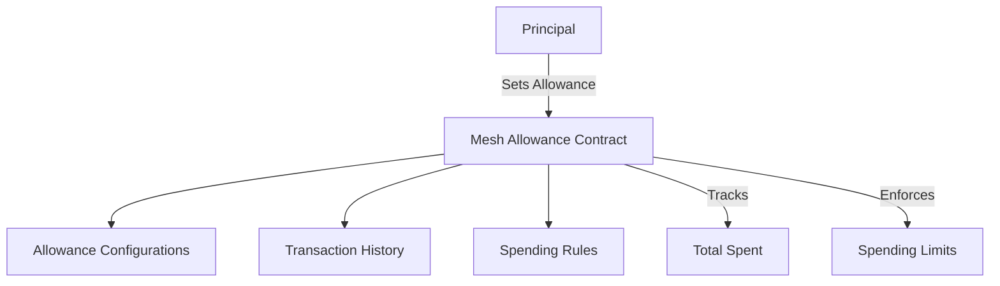

# Mesh Allowance

A decentralized spending allowance management protocol that enables secure, transparent financial tracking and controlled spending across multiple principals.

## Overview

Mesh Allowance is a blockchain-based financial management system that provides granular control over spending allocations. Key features include:
- Customizable spending limits
- Transaction tracking
- Multi-principal allowance management
- Secure, transparent spending rules
- Flexible permission configurations

## Architecture

The Mesh Allowance system is built around a core smart contract that manages financial allowances and transaction history.



The contract implements several key data structures:
- `allowances`: Tracks spending limits between principals
- `transaction-history`: Records detailed transaction data
- `allowance-rules`: Manages additional permission settings

## Contract Documentation

### Core Functionality

#### Allowance Management
- Dynamic spending limit configuration
- Principal-based access control
- Granular transaction tracking

#### Spending Controls
- Enforce total spending limits
- Prevent overspending
- Detailed transaction logging
- Configurable modification permissions

## Getting Started

### Prerequisites
- Clarinet
- Stacks wallet for testing

### Basic Usage

1. Set a spending allowance:
```clarity
(contract-call? .mesh-allowance set-allowance 
    'SPENDER_ADDRESS  ;; Spender principal
    u1000  ;; Total spending limit
)
```

2. Spend from an allowance:
```clarity
(contract-call? .mesh-allowance spend-allowance 
    'OWNER_ADDRESS  ;; Owner principal
    u250  ;; Spending amount
    "Monthly subscription"  ;; Transaction description
)
```

## Function Reference

### Public Functions

#### `set-allowance`
Establish a new spending allowance
```clarity
(set-allowance spender total-limit (optional description))
```

#### `spend-allowance`
Execute a spending transaction
```clarity
(spend-allowance owner amount description)
```

#### `modify-allowance`
Update an existing allowance limit
```clarity
(modify-allowance spender new-limit)
```

### Read-Only Functions

#### `get-allowance-details`
```clarity
(get-allowance-details owner spender) ;; Returns current allowance configuration
```

#### `get-transaction-history`
```clarity
(get-transaction-history owner spender) ;; Returns transaction records
```

## Development

### Testing
1. Clone the repository
2. Install Clarinet
3. Run tests:
```bash
clarinet test
```

### Local Development
1. Start Clarinet console:
```bash
clarinet console
```

## Security Considerations

### Financial Controls
- Strict spending limit enforcement
- Transaction logging for accountability
- Principal-based access restrictions

### Limitations
- Allowances are principal-specific
- Cannot retroactively modify completed transactions
- Requires explicit authorization for spending

### Best Practices
- Set conservative initial spending limits
- Regularly review transaction histories
- Use optional approval mechanisms for high-risk scenarios